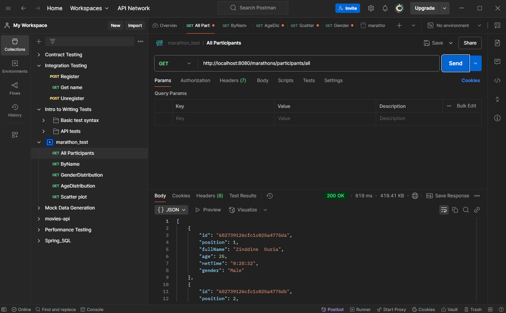
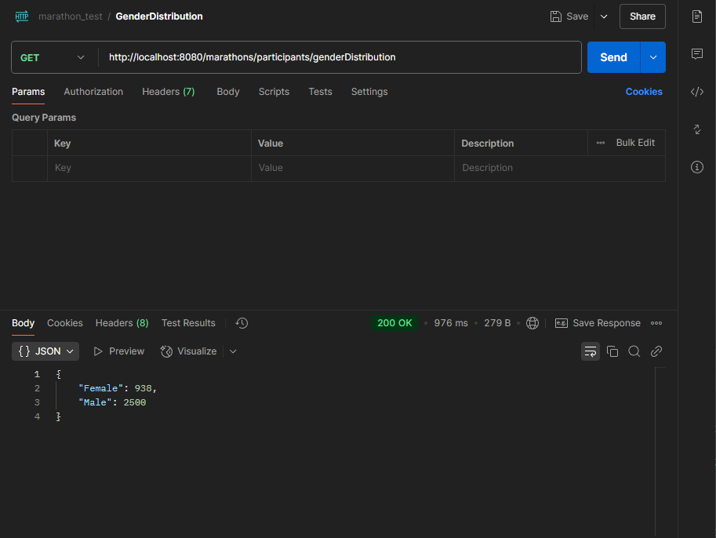
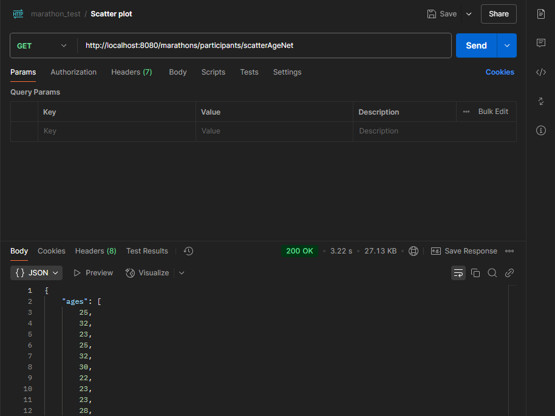
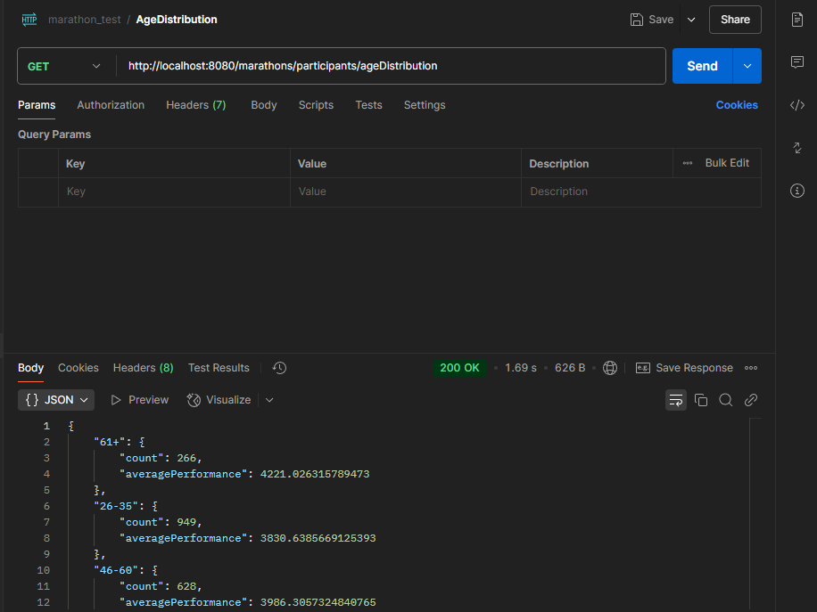
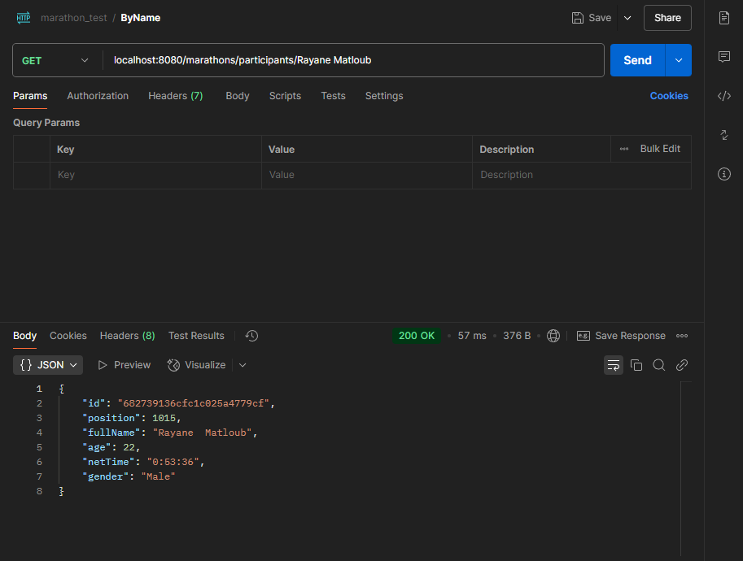
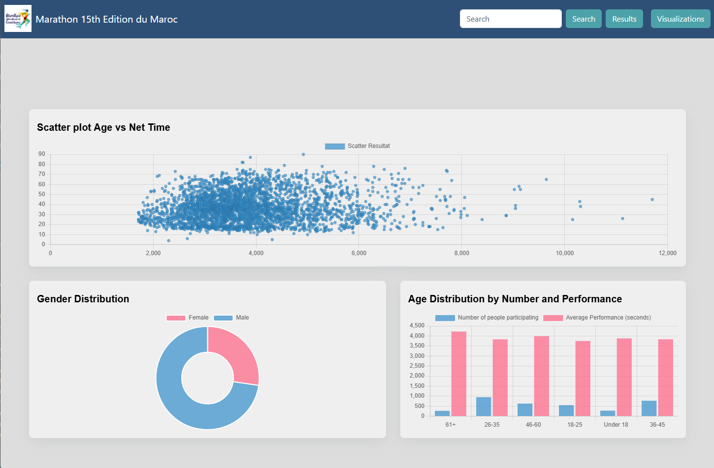
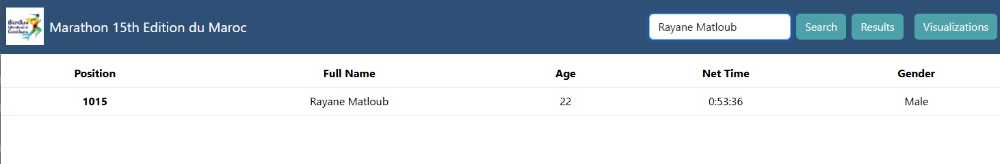
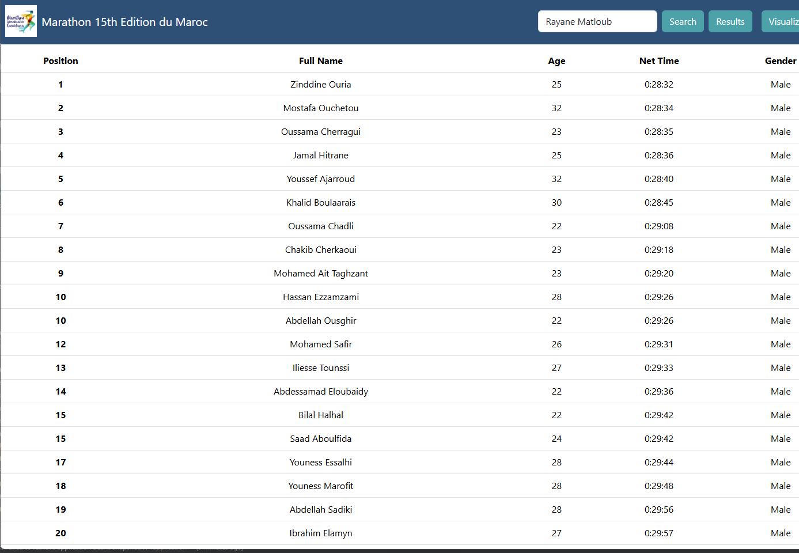

# 🏃‍♂️ Marathon Project
This project is a full-stack application to manage and visualize marathon race data. It uses a **Spring Boot** backend with **MongoDB** for data storage and a **React** frontend with **Chart.js** for data visualization.
---
## 📚 Table of Contents
- [Project Overview](#project-overview)
- [Backend](#backend)
- [Frontend](#frontend)
- [Data Processing](#data-processing)
- [How to Run](#how-to-run)
- [Screenshots](#screenshots)
- [Technologies Used](#technologies-used)
- [Notes](#notes)
- [Contributors](#contributors)
---
## 🧾 Project Overview
The Marathon Project fetches race results from external sources, processes the data using a Python script, stores it in MongoDB, and displays statistics and charts in a user-friendly React frontend.
---
## ⚙️ Backend
- Developed with **Spring Boot**.
- Provides **RESTful API** endpoints to query race and participant data.
- Uses **MongoDB** to store processed race results.
- Tested using **Postman** for API validation.
### 🔧 How to Build and Run Backend
```bash
./mvnw clean package
java -jar target/Marathon-0.0.1-SNAPSHOT.jar
```
Make sure MongoDB is running and the `application.properties` is configured correctly.
---
## 💻 Frontend
- Developed with **React**.
- Uses **Chart.js** to visualize marathon results (e.g., rankings, timings, category distribution).
- Built and served with **npm** and **serve**.
### 🛠️ How to Build and Run Frontend Locally
```bash
cd frontend
npm install
npm run build
npx serve -s .
```
Then open your browser at [http://localhost:3000](http://localhost:3000)
---
## 🐍 Data Processing
- A **Python script** scrapes marathon result data from [RaceTimer](https://www.racetimer.se/fr/race/resultlist/6212?race_id=6212&layout=racetimer&rc_id=24165&per_page=25&commit=Rechercher+%3E%3E).
- The data is cleaned and transformed to match the **MongoDB** schema.
- The script inserts the processed data into the `Marathon` collection in MongoDB.
---
## ▶️ How to Run
1. Run **MongoDB** (locally or via Docker).
2. Run the **Python script** to scrape and import race data.
3. Start the **Spring Boot backend** using the `java -jar` command.
4. Build and serve the **React frontend**.
---
## 📸 Screenshots
### Backend API tested on Postman





### Frontend UI



---
## 🧰 Technologies Used
- **Java 17**, **Spring Boot**
- **MongoDB**
- **React**, **Chart.js**
- **Python** (data scraping and processing)
- **Postman** (API testing)
- **npm**, **serve** (frontend build and serve)
---
## 📝 Notes
- This repository includes:
  - The **Spring Boot build backend**
  - The **React frontend build output**
  - The  **Processing phase**
---
## 👥 Contributors
This project was developed by:
- **Rayane MATLOUB** - [rayane.matloub2@gmail.com](mailto:rayane.matloub2@gmail.com)
- **Yasser LAKRAIMI** - [yasserlk27@gmail.com](mailto:yasserlk27@gmail.com)

For questions or support, please feel free to contact either contributor.
- **Yasser LAKRAIMI** - [yasserlk27@gmail.com](mailto:yasserlk27@gmail.com)

For questions or support, please feel free to contact either contributor.
